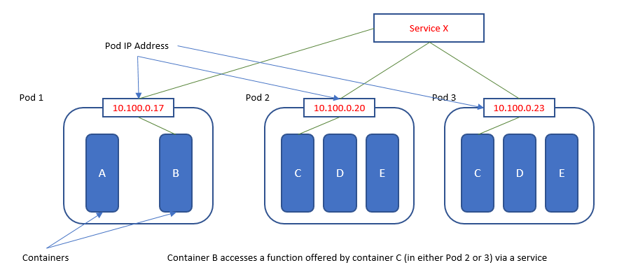

# KUBERNETES

> Kubernetes es una plataforma de orquestación de contenedores que elimina muchos de los procesos manuales involucrados en la implementación y escalado de aplicaciones en contenedores. Permite gestionar y coordinar la ejecución de contenedores en un clúster de servidores.

Kubernetes en Google


Service y Pod



## WHAT IS AND CHARACTERISTICS

- Kubernetes utiliza un plano de control que se encarga de gestionar y coordinar los recursos del clúster, como los nodos y los pods.

- Kubernetes ofrece características como el escalado automático, el balanceo de carga, la gestión de volúmenes de almacenamiento y la gestión de la salud de los pods.

- Los objetos de Kubernetes, como los Deployments, Services, Secrets y ConfigMaps, se definen en archivos de configuración YAML o JSON.

- Kubernetes utiliza etiquetas y selectores para agrupar y seleccionar conjuntos de pods y otros recursos.

- Kubernetes es una plataforma extensible y se puede ampliar mediante la creación de controladores personalizados y la integración con otras herramientas y servicios.

## SERVICES (ejemplo en postgres.yaml)

> Los servicios en Kubernetes son una abstracción que nos permite acceder a nuestras aplicaciones y definir conjuntos de pods que implementan un microservicio. Un servicio ofrece una dirección virtual (CLUSTER-IP) y un nombre que identifica al conjunto de pods que representa. Esto nos permite conectarnos a los pods a través del servicio, ya sea desde otros pods internos o desde el exterior mediante la generación de un puerto aleatorio.

### Types of services into Kubernetes

- ClusterIP: Este es el tipo de servicio por defecto. Solo permite el acceso interno entre distintos servicios. Los pods dentro del clúster pueden acceder a este servicio utilizando su dirección IP virtual (CLUSTER-IP).

- NodePort: Este tipo de servicio expone el servicio en un puerto estático en cada nodo del clúster. Permite el acceso externo al servicio utilizando la dirección IP del nodo y el puerto asignado.

- LoadBalancer: Este tipo de servicio crea un balanceador de carga externo que distribuye el tráfico entre los pods del servicio. El balanceador de carga asigna una dirección IP externa y redirige el tráfico a los pods

### Example of how define one service into Kubernetes

```yaml
  apiVersion: v1
  kind: Service
  metadata:
    name: mi-servicio
  spec:
    selector:
      app: mi-aplicacion
    ports:
      - protocol: TCP
        port: 80
        targetPort: 8080
    type: ClusterIP
```

## PODS (ejemplo en postgres.yaml)

> Un Pod en Kubernetes es la unidad más pequeña y básica de despliegue que se puede crear y gestionar en esta plataforma. Un Pod es un grupo de uno o más contenedores, como contenedores Docker, que comparten almacenamiento y red, y tienen especificaciones sobre cómo ejecutar los contenedores

- Los Pods encapsulan uno o varios contenedores que se ejecutan en el mismo nodo y comparten elementos como la red y el almacenamiento

- Los contenedores dentro de un Pod tienen direcciones IP distintas y generalmente se comunican a través de las direcciones IP propias del Pod

- Los Pods pueden estar compuestos por un solo contenedor o por varios contenedores que tienen una conexión directa entre ellos.

- Los Pods son la unidad de cómputo más pequeña en Kubernetes y se utilizan para ejecutar aplicaciones y servicios.

- Los Pods se programan en los nodos de Kubernetes para su ejecución y pueden ser terminados o reprogramados según las necesidades de recursos y prioridades.

- Los Pods también pueden ser gestionados por controladores en Kubernetes, como el controlador ReplicaSet, que se encarga de la replicación y escalado de los Pods.

### Example of how use Pod into Kubernetes

```yaml
  apiVersion: v1
  kind: Pod
  metadata:
    name: mi-pod
  spec:
    containers:
    - name: mi-contenedor
      image: mi-imagen
      ports:
      - containerPort: 80
```

## SECRETS

> Los Secrets pueden ser utilizados por los pods como variables de entorno, argumentos de línea de comandos o archivos de configuración en un volumen.

- Un Secret es un objeto que contiene una pequeña cantidad de datos sensibles, como contraseñas, tokens o claves.

- Los Secrets se utilizan para almacenar información confidencial que no debe incluirse en el código de la aplicación.

- Los Secrets se almacenan en base64 en Kubernetes, pero no están encriptados automáticamente.

- Algunos ejemplos de uso de Secrets son almacenar credenciales de bases de datos, claves de API o certificados SSL.

### Example of Secret

```yaml
  apiVersion: v1
  kind: Secret
  metadata:
    name: mi-secret
  type: Opaque
  data:
    username: dXNlcm5hbWU=
    password: cGFzc3dvcmQ=
```

## CONFIGMAPS

> Los ConfigMaps pueden ser utilizados por los pods como variables de entorno, argumentos de línea de comandos o archivos de configuración en un volumen.

- Un ConfigMap es un objeto que se utiliza para almacenar datos no confidenciales en pares clave-valor.

- Los ConfigMaps se utilizan para almacenar información de configuración que puede ser consumida por los pods.

- A diferencia de los Secrets, los ConfigMaps no proporcionan seguridad ni encriptación automática.

- Algunos ejemplos de uso de ConfigMaps son almacenar configuraciones de aplicaciones, variables de entorno o archivos de configuración.

### Example of ConfigMap

```yaml
  apiVersion: v1
  kind: ConfigMap
  metadata:
    name: mi-configmap
  data:
    app_config: |
      key1=value1
      key2=value2
```

## DEPLOYMENTS (ejemplo en postgres.yaml)

> Un Deployment en Kubernetes es un objeto que se utiliza para gestionar la implementación y actualización de aplicaciones en el clúster. Proporciona una forma declarativa de definir y controlar el estado deseado de los pods y garantiza que el número especificado de réplicas esté en funcionamiento en todo momento.

- Un Deployment define un conjunto de réplicas de pods y las reglas para su despliegue y actualización.

- Los Deployments permiten realizar actualizaciones sin tiempo de inactividad, ya que se encargan de crear nuevos pods antes de eliminar los antiguos.

- Los Deployments también proporcionan funcionalidades como la reversión a una versión anterior y el escalado automático de réplicas en función de la carga.

- Los Deployments utilizan el controlador ReplicaSet para garantizar que el número deseado de réplicas esté en funcionamiento y mantener la alta disponibilidad de la aplicación.

- Los Deployments se definen utilizando archivos de configuración YAML o JSON, donde se especifica el nombre, las réplicas, la imagen del contenedor y otras configuraciones.

### Example of how use Kubernetes to define one Deployment

 En este ejemplo, se crea un Deployment llamado "mi-deployment" que tiene 3 réplicas de un pod. El pod utiliza un contenedor llamado "mi-contenedor" con la imagen "mi-imagen" y se expone en el puerto 80.

```yaml
  apiVersion: apps/v1
  kind: Deployment
  metadata:
    name: mi-deployment
  spec:
    replicas: 3
    selector:
      matchLabels:
        app: mi-aplicacion
    template:
      metadata:
        labels:
          app: mi-aplicacion
      spec:
        containers:
        - name: mi-contenedor
          image: mi-imagen
          ports:
          - containerPort: 80
```

## INGRESS

> Los Ingress en Kubernetes son objetos que se utilizan para exponer servicios HTTP y HTTPS externamente al clúster. Proporcionan una forma de enrutar el tráfico de entrada a los servicios dentro del clúster.

- Un Ingress actúa como una capa de entrada para el tráfico externo y permite el enrutamiento basado en reglas a diferentes servicios dentro del clúster.

- Los Ingress se definen utilizando reglas que especifican las rutas y los servicios a los que se debe dirigir el tráfico.

- Los Ingress pueden realizar balanceo de carga, terminación SSL y redirecciones.
Para que los Ingress funcionen correctamente, se requiere un controlador de Ingress en el clúster, como Nginx Ingress Controller o Traefik.

- Los Ingress se pueden configurar utilizando archivos de configuración YAML o utilizando herramientas de línea de comandos como kubectl.

### Example of how define a ingress into Kubernetes

```yaml
  apiVersion: networking.k8s.io/v1
  kind: Ingress
  metadata:
    name: mi-ingress
  spec:
    rules:
      - host: mi-dominio.com
        http:
          paths:
            - path: /servicio1
              pathType: Prefix
              backend:
                service:
                  name: servicio1
                  port:
                    number: 80
            - path: /servicio2
              pathType: Prefix
              backend:
                service:
                  name: servicio2
                  port:
                    number: 80
```

## STATEFULSET

> Un StatefulSet en Kubernetes es un controlador que se utiliza para administrar y mantener uno o más pods. A diferencia de otros controladores como ReplicaSets o Deployments, un StatefulSet mantiene una identidad única y persistente para cada uno de sus pods.

- Un StatefulSet es adecuado para aplicaciones que requieren un estado persistente, como bases de datos o aplicaciones que almacenan datos en disco.

- Cada pod en un StatefulSet tiene un nombre y un identificador persistente que se mantiene incluso si el pod se reinicia o se reprograma.

- Los StatefulSets se utilizan en combinación con volúmenes persistentes para garantizar que los datos se conserven incluso si los pods se eliminan o se crean nuevos pods.

- Los StatefulSets también pueden trabajar en conjunto con servicios headless para permitir la comunicación directa con cada pod individualmente.

- Al eliminar un StatefulSet, los volúmenes asociados no se eliminan automáticamente para garantizar la seguridad y persistencia de los datos

### Example of how define one Statefulset en Kubernetes

> En este ejemplo, se crea un StatefulSet llamado "mi-statefulset" con 3 réplicas de un pod. Cada pod utiliza un contenedor llamado "mi-contenedor" con la imagen "mi-imagen" y se expone en el puerto 80. Además, se define un volumen persistente llamado "mi-volumen" con una capacidad de 1Gi para cada pod.

```yaml
  apiVersion: apps/v1
  kind: StatefulSet
  metadata:
    name: mi-statefulset
  spec:
    replicas: 3
    selector:
      matchLabels:
        app: mi-aplicacion
    template:
      metadata:
        labels:
          app: mi-aplicacion
      spec:
        containers:
        - name: mi-contenedor
          image: mi-imagen
          ports:
          - containerPort: 80
    volumeClaimTemplates:
    - metadata:
        name: mi-volumen
      spec:
        accessModes: [ "ReadWriteOnce" ]
        resources:
          requests:
            storage: 1Gi
```
